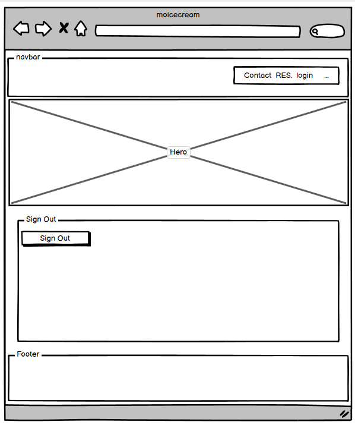

# [MO ICE CREAM](https://moice-161ddda3bde4.herokuapp.com)

[](https://github.com/primarypigments/mo_ice_cream/commits/main)
[](https://github.com/primarypigments/mo_ice_cream/commits/main)
[](https://github.com/primarypigments/mo_ice_cream)

---

Mo Ice Cream brings a fresh and delightful twist to the traditional ice cream experience, directly to the heart of small villages. In a world where the simple pleasures of a local ice cream shop are often missing, Mo Ice Cream stands out by offering a unique, reservation-centered pop-up experience that promises not only to serve but to create lasting memories. With an exclusive selection of three meticulously crafted flavors, we ensure each scoop is a testament to our passion for quality and simplicity. Limited to just 150 scoops per event, we guarantee exclusivity and freshness, making each visit a special occasion.

Our project is designed with a clear purpose: to bring joy and a touch of sweetness to communities that lack the luxury of an ice cream shop. By focusing on small villages, Mo Ice Cream fills a significant gap, turning the absence of an ice cream parlor into an opportunity for a shared, communal event. It’s not just about ice cream; it’s about bringing people together, fostering connections, and making the ice cream experience both personal and communal.

Behind Mo Ice Cream is a heartwarming father-and-son duo, embodying the spirit of family and the joys of shared entrepreneurial endeavors. This personal touch adds a layer of intimacy and trust to our service, making each pop-up not just a business transaction, but a visit from friends who genuinely care about bringing happiness to the community. Our target audience isn’t just ice cream lovers; it’s anyone seeking to indulge in a moment of joy, community spirit, and the simple pleasure of a delicious ice cream scoop.

Mo Ice Cream is more than just a pop-up; it's a beacon of joy, a catalyst for community gathering, and a reminder of the simple pleasures that life offers. We invite you to embrace this unique experience, where every scoop is served with love, care, and the warmth of family values. Join us in making every event a memorable one, where the joy of ice cream is shared, and every flavor tells a story of passion, quality, and community.


source: [amiresponsive](https://ui.dev/amiresponsive?url=https://moice-161ddda3bde4.herokuapp.com)

## UX

🛑🛑🛑🛑🛑🛑🛑🛑🛑START OF NOTES (to be deleted)

In this section, you will briefly explain your design processes.

🛑🛑🛑🛑🛑🛑🛑🛑🛑🛑-END OF NOTES (to be deleted)

### Colour Scheme

🛑🛑🛑🛑🛑🛑🛑🛑🛑START OF NOTES (to be deleted)

My color scheme creates a visually appealing and psychologically stimulating environment tailored to Mo ice Cream . The choice of a light, warm background and dark text ensures readability and comfort, while the orange-red highlights inject energy and draw attention to key actions and messages. This thoughtful use of color can enhance user engagement and contribute to a positive user experience.
🛑🛑🛑🛑🛑🛑🛑🛑🛑🛑-END OF NOTES (to be deleted)

- `#f8f1e8` used for Body background color.
- `#2b2929` used for primary text.
- `#e96a3f` used for primary highlights.
- `#f8f1e8` used for secondary text.
- `#c95631` used for secondary highlights.

🛑🛑🛑🛑🛑🛑🛑🛑🛑START OF NOTES (to be deleted)

Consider adding a link and screenshot for your colour scheme using "coolors".
https://coolors.co/generate

When you add a colour to the palette, the URL is dynamically updated, making it easier for you to return back to your colour palette later if needed.

Example:

🛑🛑🛑🛑🛑🛑🛑🛑🛑🛑-END OF NOTES (to be deleted)

I used [coolors.co](https://coolors.co/e84610-009fe3-4a4a4f-445261-d63649-e6ecf0-000000) to generate my colour palette.


🛑🛑🛑🛑🛑🛑🛑🛑🛑START OF NOTES (to be deleted)

⚠️ ONLY IF YOU ACTUALLY ADDED `:root` variables in CSS! ⚠️
If you've used CSS `:root` variables, consider also including a code snippet here!

🛑🛑🛑🛑🛑🛑🛑🛑🛑🛑-END OF NOTES (to be deleted)

I've used CSS `:root` variables to easily update the global colour scheme by changing only one value, instead of everywhere in the CSS file.

```css
:root {
    /* P = Primary | S = Secondary */
    --p-text: #000000;
    --p-highlight: #E84610;
    --s-text: #4A4A4F;
    --s-highlight: #009FE3;
    --white: #FFFFFF;
    --black: #000000;
}
```

### Typography

🛑🛑🛑🛑🛑🛑🛑🛑🛑START OF NOTES (to be deleted)

My choice of "Patrick Hand" for Mo Ice Cream is rooted in a desire to create a friendly, approachable, and memorable online presence that aligns with the brand's identity and values, while ensuring good user experience and accessibility.


🛑🛑🛑🛑🛑🛑🛑🛑🛑🛑-END OF NOTES (to be deleted)

- [Patrick Hand](https://fonts.googleapis.com/css2?family=Patrick+Hand&display=swap") was used for the primary headers and titles.

- [Font Awesome](https://fontawesome.com) icons were used throughout the site, such as the social media icons in the footer.

## User Stories

### New Site Users

- As a new site user, I would like to easily navigate the menu of ice cream flavors, so that I can quickly find that appeal to me and my family.
- As a new site user, I would like to view images and descriptions of the ice cream flavors, so that I can make an informed decision about what to order based on taste preferences.
- As a new site user, I would like to create an account to save my reservation, so that I can quickly keep track of my schedual.

 
### Returning Site Users

- As a returning site user, I would like to modify or cancel an existing reservation, so that I can adjust my plans based on unforeseen schedule changes.
- As a returning site user, I would like to delete a past reservation from my history, so that I can keep my account organized and focused on upcoming plans.
- As a returning site user, I would like to edit the details of an existing reservation, so that I can adjust the time, date, or location according to my current needs.
- As a returning site user, I would like to easily reset my password, so that I can maintain access to my account securely in case I forget my login details.
- As a returning site user, I would like to interact with social media, so that I can engage with other ice cream enthusiasts, share experiences, and provide suggestions for the service.

### Site Admin

- As a site administrator, I should be able to view, edit, and delete any reservations, so that I can assist users with their booking needs and resolve any conflicts.
- As a site administrator, I should be able to reset user passwords upon request, so that I can provide support for account access issues.
- As a site administrator, I should be able to add, update, or remove ice cream flavors and descriptions, so that I can keep the menu current with available offerings.
- As a site administrator, I should be able to manage the locations of the pop-up service, so that I can ensure accurate and up-to-date information is available for users.

## Wireframes

To follow best practice, wireframes were developed for mobile, tablet, and desktop sizes.
I've used [Balsamiq](https://balsamiq.com/wireframes) to design my site wireframes.

### Mobile Wireframes

<details>
<summary> Click here to see the Mobile Wireframes </summary>

Home
  - 

Contact
  - 

Login
  - 

Register
  - 

Make Reservation
  - 

Profile
  - 

Edit Reservation
  - 


Cancel Reservation
  - 


Delete Reservation
  - 


Forgot Password
  - 


Password Reset Info
  - 


Password Reset Confirm
  - 


Password Reset Complete
  - 


Logout
  - 


etc.
  - repeat for any remaining mobile wireframes

</details>

### Tablet Wireframes

<details>
<summary> Click here to see the Tablet Wireframes </summary>

Home
  - 

Contact
  - 

Login
  - 

Register
  - 

Make Reservation
  - 

Profile
  - 

Edit Reservation
  - 


Cancel Reservation
  - 


Delete Reservation
  - 

Logout
  - 


</details>

### Desktop Wireframes

<details>
<summary> Click here to see the Desktop Wireframes </summary>

Home
  - 

Contact
  - 

Login
  - 

Register
  - 

Make Reservation
  - 

Profile
  - 

Edit Reservation
  - 


Cancel Reservation
  - 


Delete Reservation
  - 

Logout
  - 


</details>

## Features

### Existing Features

- **Registration Page**

    - This feature allows new users to create an account on your website, enabling them to make and manage their ice cream reservations. The registration process is designed to be quick and user-friendly, ensuring that even first-time visitors can easily navigate through the steps. 


- **Password Reset**

    - A password reset feature is crucial for user convenience and security, providing a straightforward way for users to recover their accounts in case they forget their passwords. This functionality underscores your commitment to protecting user data and ensuring easy access to their accounts, thereby fostering trust and reliability in Mo Ice Cream website.


- **Calendar Widget for Making a Reservation**

    - The calendar widget is a key feature that allows users to select and book their visit to your pop-up ice cream shop on their preferred date. This interactive tool is designed to provide a seamless booking experience,and offering immediate confirmation. This feature addresses the user's need for convenience and efficiency, making it simple for them to plan their visit around their schedule.


- **Edit Reservation**

    - With the edit reservation feature, users have the flexibility to modify their booking details, such as the date, time, or location. This functionality is important for accommodating changes in users' plans, ensuring they can always enjoy their ice cream experience without any hassle. It enhances user satisfaction by providing them with control over their reservations, reflecting our website's user-centric approach.


- **Cancel Reservation**

    - The cancel reservation feature allows users to easily cancel their bookings through the website. This option is essential for managing unforeseen changes in plans, offering users the freedom to make adjustments as needed without penalty. By including this feature, your website demonstrates understanding and consideration for the user's circumstances, further enhancing their experience and loyalty to our brand.


- **Delete Reservation**

    - Users can permanently remove a reservation from their history with the delete reservation feature. This functionality is particularly useful for keeping the user's booking history organized and relevant. It also respects the user's preference for privacy and control over their data, aligning with best practices for user experience and data management.


### Future Features

- Real-Time Pop-Up Location Tracker
Feature Overview: Implement a real-time tracking system for the pop-up ice cream village, allowing customers to see the exact location of the service at any given time, along with the estimated wait times..
- Customer Flavor Voting Contests
Feature Overview: Organize regular contests where customers can vote on new flavors to be introduced to the menu. The winning flavor could be available for a limited time.
- Family Loyalty Program
Feature Overview: Develop a loyalty program specifically designed for families, offering rewards, discounts, or freebies based on the frequency of visits or the number of orders placed.

## Tools & Technologies Used


- [](https://tim.2bn.dev/markdown-builder) used to generate README and TESTING templates.
- [](https://git-scm.com) used for version control. (`git add`, `git commit`, `git push`)
- [](https://github.com) used for secure online code storage.
- [](https://gitpod.io) used as a cloud-based IDE for development.
- [](https://en.wikipedia.org/wiki/HTML) used for the main site content.
- [](https://en.wikipedia.org/wiki/CSS) used for the main site design and layout.
- [](https://www.javascript.com) used for user interaction on the site.
- [](https://www.python.org) used as the back-end programming language.
- [](https://www.heroku.com) used for hosting the deployed back-end site.
- [](https://getbootstrap.com) used as the front-end CSS framework for modern responsiveness and pre-built components.
- [](https://www.djangoproject.com) used as the Python framework for the site.
- [](https://www.postgresql.org) used as the relational database management.
- [](https://dbs.ci-dbs.net) used as the Postgres database from Code Institute.
- [](https://whitenoise.readthedocs.io) used for serving static files with Heroku.
- [](https://mail.google.com) used for sending emails in my application.
- [](https://balsamiq.com/wireframes) used for creating wireframes.
- [](https://fontawesome.com) used for the icons.
- [](https://chat.openai.com) used to help debug, troubleshoot, and explain things.

## Database Design

Entity Relationship Diagrams (ERD) help to visualize database architecture before creating models.
Understanding the relationships between different tables can save time later in the project.

```python
class Reservation(models.Model):
    """
    Custom model to have users book a reservation at Mo Ice Cream
    """
    customer = models.ForeignKey(
        User, on_delete=models.CASCADE, related_name='reservations')
    phone_number = models.CharField(
    max_length=17, validators=[
        validate_phone_number], null=False, blank=False)
    date = models.DateField(
        null=False, blank=False, validators=[validate_future_date])
    time_slot = models.CharField(max_length=10, choices=[
        ('Morning', 'Morning'),
        ('Afternoon', 'Afternoon'),
        ('Evening', 'Evening'),
    ], null=False, blank=False)
    location = models.CharField(max_length=25, choices=[
        ('Kakenstorf', 'Kakenstorf'),
        ('Regesbostel', 'Regesbostel'),
        ('Brackel', 'Brackel'),
        ('Wistedt', 'Wistedt'),
        ('Eyendorf', 'Eyendorf'),
    ], null=False, blank=False)
    status = models.CharField(max_length=10, choices=[
        ('Pending', 'Pending'),
        ('Confirmed', 'Confirmed'),
        ('Canceled', 'Canceled'),
    ], default="Pending")
    book_date = models.DateTimeField(auto_now_add=True)


class ContactMessage(models.Model):
    name = models.CharField(max_length=40)
    email = models.EmailField()
    message = models.TextField(max_length=350)
    submitted_at = models.DateTimeField(auto_now_add=True)
```

I have used `pygraphviz` and `django-extensions` to auto-generate an ERD.

The steps taken were as follows:
- In the terminal: `sudo apt update`
- then: `sudo apt-get install python3-dev graphviz libgraphviz-dev pkg-config`
- then type `Y` to proceed
- then: `pip3 install django-extensions pygraphviz`
- in my `settings.py` file, I added the following to my `INSTALLED_APPS`:
```python
INSTALLED_APPS = [
    ...
    'django_extensions',
    ...
]
```
- back in the terminal: `python3 manage.py graph_models -a -o erd.png`
- dragged the new `erd.png` file into my `documentation/` folder
- removed `'django_extensions',` from my `INSTALLED_APPS`
- finally, in the terminal: `pip3 uninstall django-extensions pygraphviz -y`


source: [medium.com](https://medium.com/@yathomasi1/1-using-django-extensions-to-visualize-the-database-diagram-in-django-application-c5fa7e710e16)


## Agile Development Process

### GitHub Projects

[GitHub Projects](https://github.com/primarypigments/mo_ice_cream/projects) served as an Agile tool for this project.
It isn't a specialized tool, but with the right tags and project creation/issue assignments, it can be made to work.

Through it, user stories, issues, and milestone tasks were planned, then tracked on a weekly basis using the basic Kanban board.

🛑🛑🛑🛑🛑🛑🛑🛑🛑🛑 START OF NOTES (to be deleted)

Consider adding a basic screenshot of your Projects Board.

🛑🛑🛑🛑🛑🛑🛑🛑🛑🛑-END OF NOTES (to be deleted)


### GitHub Issues

[GitHub Issues](https://github.com/primarypigments/mo_ice_cream/issues) served as an another Agile tool.
There, I used my own **User Story Template** to manage user stories.

It also helped with milestone iterations on a weekly basis.

🛑🛑🛑🛑🛑🛑🛑🛑🛑🛑 START OF NOTES (to be deleted)

Consider adding a screenshot of your Open and Closed Issues.

🛑🛑🛑🛑🛑🛑🛑🛑🛑🛑-END OF NOTES (to be deleted)

- [Open Issues](https://github.com/primarypigments/mo_ice_cream/issues) [](https://github.com/primarypigments/mo_ice_cream/issues)

    

- [Closed Issues](https://github.com/primarypigments/mo_ice_cream/issues?q=is%3Aissue+is%3Aclosed) [](https://github.com/primarypigments/mo_ice_cream/issues?q=is%3Aissue+is%3Aclosed)

    

### MoSCoW Prioritization

I've decomposed my Epics into stories prior to prioritizing and implementing them.
Using this approach, I was able to apply the MoSCow prioritization and labels to my user stories within the Issues tab.

- **Must Have**: guaranteed to be delivered (*max 60% of stories*)
- **Should Have**: adds significant value, but not vital (*the rest ~20% of stories*)
- **Could Have**: has small impact if left out (*20% of stories*)
- **Won't Have**: not a priority for this iteration

## Testing

> [!NOTE]  
> For all testing, please refer to the [TESTING.md](TESTING.md) file.

## Deployment

The live deployed application can be found deployed on [Heroku](https://moice-161ddda3bde4.herokuapp.com).

### PostgreSQL Database

This project uses a [Code Institute PostgreSQL Database](https://dbs.ci-dbs.net).

To obtain my own Postgres Database from Code Institute, I followed these steps:

- Signed-in to the CI LMS using my email address.
- An email was sent to me with my new Postgres Database.

> [!CAUTION]  
> - PostgreSQL databases by Code Institute are only available to CI Students.
> - You must acquire your own PostgreSQL database through some other method
> if you plan to clone/fork this repository.
> - Code Institute students are allowed a maximum of 8 databases.
> - Databases are subject to deletion after 18 months.

### Gmail API

This project uses [Gmail](https://mail.google.com) to handle sending emails to users for account verification and purchase order confirmations.

Once you've created a Gmail (Google) account and logged-in, follow these series of steps to get your project connected.

- Click on the **Account Settings** (cog icon) in the top-right corner of Gmail.
- Click on the **Accounts and Import** tab.
- Within the section called "Change account settings", click on the link for **Other Google Account settings**.
- From this new page, select **Security** on the left.
- Select **2-Step Verification** to turn it on. (verify your password and account)
- Once verified, select **Turn On** for 2FA.
- Navigate back to the **Security** page, and you'll see a new option called **App passwords**.
- This might prompt you once again to confirm your password and account.
- Select **Mail** for the app type.
- Select **Other (Custom name)** for the device type.
	- Any custom name, such as "Django" or "mo-ice-cream"
- You'll be provided with a 16-character password (API key).
	- Save this somewhere locally, as you cannot access this key again later!
	- `EMAIL_HOST_PASS` = user's 16-character API key
	- `EMAIL_HOST_USER` = user's own personal Gmail email address

### Heroku Deployment

This project uses [Heroku](https://www.heroku.com), a platform as a service (PaaS) that enables developers to build, run, and operate applications entirely in the cloud.

Deployment steps are as follows, after account setup:

- Select **New** in the top-right corner of your Heroku Dashboard, and select **Create new app** from the dropdown menu.
- Your app name must be unique, and then choose a region closest to you (EU or USA), and finally, select **Create App**.
- From the new app **Settings**, click **Reveal Config Vars**, and set your environment variables.

> [!IMPORTANT]  
> This is a sample only; you would replace the values with your own if cloning/forking my repository.

| Key | Value |
| --- | --- |
| `HOST` | user's own value |
| `EMAIL_HOST_USER` | user's own value |
| `EMAIL_HOST_PASS` | user's own value |
| `CLOUDINARY_URL` | user's own value |
| `DATABASE_URL` | user's own value |
| `DISABLE_COLLECTSTATIC` | 1 (*this is temporary, and can be removed for the final deployment*) |
| `SECRET_KEY` | user's own value |

Heroku needs three additional files in order to deploy properly.

- requirements.txt
- Procfile
- runtime.txt

You can install this project's **requirements** (where applicable) using:

- `pip3 install -r requirements.txt`

If you have your own packages that have been installed, then the requirements file needs updated using:

- `pip3 freeze --local > requirements.txt`

The **Procfile** can be created with the following command:

- `echo web: gunicorn app_name.wsgi > Procfile`
- *replace **app_name** with the name of your primary Django app name; the folder where settings.py is located*

The **runtime.txt** file needs to know which Python version you're using:
1. type: `python3 --version` in the terminal.
2. in the **runtime.txt** file, add your Python version:
	- `python-3.9.18`

For Heroku deployment, follow these steps to connect your own GitHub repository to the newly created app:

Either:

- Select **Automatic Deployment** from the Heroku app.

Or:

- In the Terminal/CLI, connect to Heroku using this command: `heroku login -i`
- Set the remote for Heroku: `heroku git:remote -a app_name` (replace *app_name* with your app name)
- After performing the standard Git `add`, `commit`, and `push` to GitHub, you can now type:
	- `git push heroku main`

The project should now be connected and deployed to Heroku!

### Local Deployment

This project can be cloned or forked in order to make a local copy on your own system.

For either method, you will need to install any applicable packages found within the *requirements.txt* file.

- `pip3 install -r requirements.txt`.

You will need to create a new file called `env.py` at the root-level,
and include the same environment variables listed above from the Heroku deployment steps.

> [!IMPORTANT]  
> This is a sample only; you would replace the values with your own if cloning/forking my repository.

Sample `env.py` file:

```python
import os

os.environ.setdefault("HOST", "user's own value")
os.environ.setdefault("EMAIL_HOST_USER", "user's own value")
os.environ.setdefault("EMAIL_HOST_PASS", "user's own value")
os.environ.setdefault("CLOUDINARY_URL", "user's own value")
os.environ.setdefault("DATABASE_URL", "user's own value")
os.environ.setdefault("SECRET_KEY", "user's own value")

# local environment only (do not include these in production/deployment!)
os.environ.setdefault("DEBUG", "True")
os.environ.setdefault("DEVELOPMENT", "True")
```

Once the project is cloned or forked, in order to run it locally, you'll need to follow these steps:

- Start the Django app: `python3 manage.py runserver`
- Stop the app once it's loaded: `CTRL+C` or `⌘+C` (Mac)
- Make any necessary migrations: `python3 manage.py makemigrations`
- Migrate the data to the database: `python3 manage.py migrate`
- Create a superuser: `python3 manage.py createsuperuser`
- Load fixtures (if applicable): `python3 manage.py loaddata file-name.json` (repeat for each file)
- Everything should be ready now, so run the Django app again: `python3 manage.py runserver`

#### Cloning

You can clone the repository by following these steps:

1. Go to the [GitHub repository](https://github.com/primarypigments/mo_ice_cream) 
2. Locate the Code button above the list of files and click it 
3. Select if you prefer to clone using HTTPS, SSH, or GitHub CLI and click the copy button to copy the URL to your clipboard
4. Open Git Bash or Terminal
5. Change the current working directory to the one where you want the cloned directory
6. In your IDE Terminal, type the following command to clone my repository:
	- `git clone https://github.com/primarypigments/mo_ice_cream.git`
7. Press Enter to create your local clone.

Alternatively, if using Gitpod, you can click below to create your own workspace using this repository.

[](https://gitpod.io/#https://github.com/primarypigments/mo_ice_cream)

Please note that in order to directly open the project in Gitpod, you need to have the browser extension installed.
A tutorial on how to do that can be found [here](https://www.gitpod.io/docs/configure/user-settings/browser-extension).

#### Forking

By forking the GitHub Repository, we make a copy of the original repository on our GitHub account to view and/or make changes without affecting the original owner's repository.
You can fork this repository by using the following steps:

1. Log in to GitHub and locate the [GitHub Repository](https://github.com/primarypigments/mo_ice_cream)
2. At the top of the Repository (not top of page) just above the "Settings" Button on the menu, locate the "Fork" Button.
3. Once clicked, you should now have a copy of the original repository in your own GitHub account!

### Local VS Deployment


The delployed Heroku application behaves slower.


## Credits

### Content

| Source | Location | Notes |
| --- | --- | --- |
| [Markdown Builder](https://tim.2bn.dev/markdown-builder) | README and TESTING | tool to help generate the Markdown files |
| [Chris Beams](https://chris.beams.io/posts/git-commit) | version control | "How to Write a Git Commit Message" |
| [Stack Overflow]( https://stackoverflow.com/questions/59701452/how-to-update-cells-in-a-google-spreadsheet-with-python-s-gspread-wks-update-cel) | entire site | used to update a cell in gsheets. |
| [Real Python](https://realpython.com/python-enumerate/) | entire site | used for enumerate throughout the code. |
| [Geeks For Geeks](https://www.geeksforgeeks.org/loops-in-python/) | entire site | used as loops resource. |
| [Stack Overflow](https://stackoverflow.com/questions/60793155/gspread-append-row-appending-data-to-different-column) | entire site | used for appending data. |
| [Geeks For Geeks](https://www.geeksforgeeks.org/python-lists/?ref=lbp) | entire site | used for python lists resource. |
| [W3Schools](https://www.w3schools.com/) | entire site | used for input validation methods. |
| [Digital Ocean](https://www.digitalocean.com/community/tutorials/python-valueerror-exception-handling-examples) | entire site | used for vauleerror thorughout my code. |
| [YouTube](https://www.youtube.com/watch?v=rfscVS0vtbw) | entire site | used for a tutorial for Getting Input From Users (48:26). |
| [ChatGPT](https://chat.openai.com/) | entire site | used for list contents (Villages within 10 km from Kakentrorf) understanding error messages, help with learning the correct vocabulary in commit messages. |
| [Django](https://docs.djangoproject.com/en/4.2/topics/db/models/) | entire site | core concept of defining models. |
| [Django](https://docs.djangoproject.com/en/4.2/ref/models/fields/#field-options) | entire site |  Understanding how to use field options such as null, blank, and default. |
| [Django](https://docs.djangoproject.com/en/4.2/ref/validators/) | entire site | create and use custom validators for model fields to enforce specific rules or formats. |
| [Django](https://docs.djangoproject.com/en/4.2/ref/models/fields/#datetimefield) | entire site | used to automatically set the field to the current date/time. |
| [Django](https://docs.djangoproject.com/en/4.2/ref/models/options/#unique-together) | entire site | used to utilized the unique_together. |
| [Django](https://docs.djangoproject.com/en/4.2/ref/templates/builtins/) | entire site | used for built-in template tags and filters. |
| [Django](https://docs.djangoproject.com/en/4.2/ref/contrib/messages/) | entire site | used for store messages in one request. |
| [Django](https://docs.djangoproject.com/en/4.2/topics/logging/) | entire site | used to perform system logging. |
| [Django](https://docs.djangoproject.com/en/4.2/topics/forms/modelforms/) | entire site | used for creating forms from models automatically,. |


### Media

| Source | Location | Type | Notes |
| --- | --- | --- | --- |
| [TinyPNG](https://tinypng.com) | entire site | image | tool for image compression |

### Acknowledgements

- I would like to thank my Code Institute mentor, [Tim Nelson](https://github.com/TravelTimN) for his support throughout the development of this project.
- I would like to thank the [Code Institute](https://codeinstitute.net) tutor team for their assistance with troubleshooting and debugging some project issues.
- I would like to thank the [Code Institute Slack community](https://code-institute-room.slack.com) for the moral support; it kept me going during periods of self doubt and imposter syndrome.
- I would like to thank my partner (John/Jane), for believing in me, and allowing me to make this transition into software development.
- I would like to thank my employer, for supporting me in my career development change towards becoming a software developer.