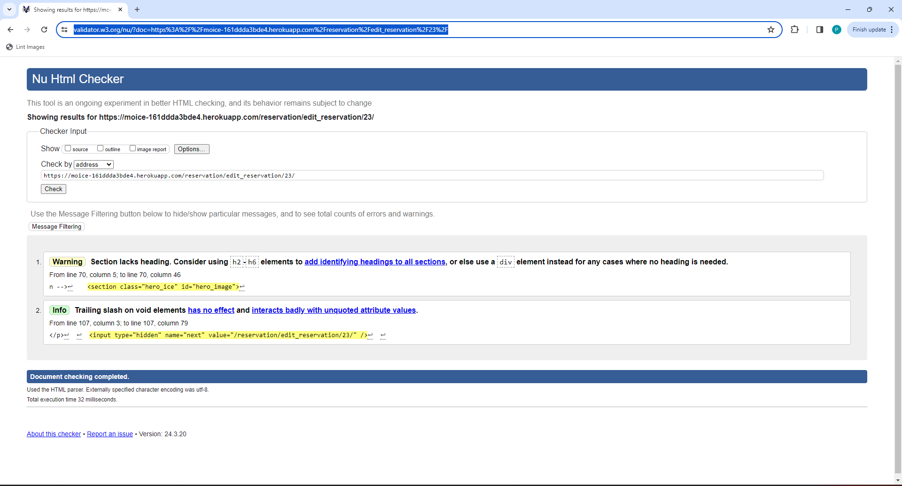
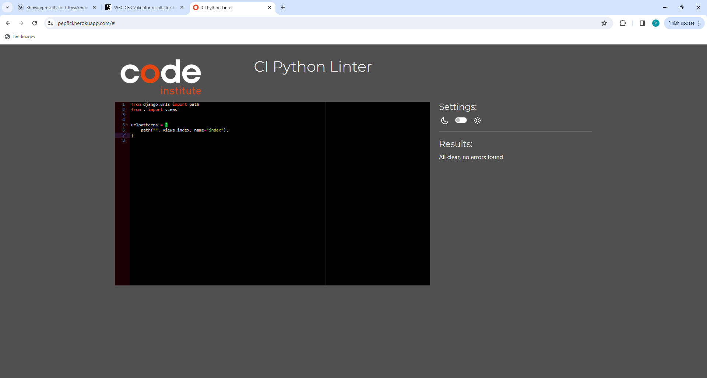
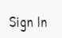
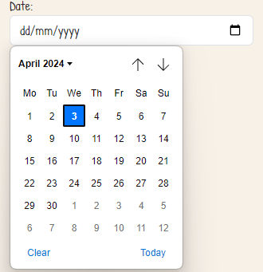

# Testing

> [!NOTE]  
> Return back to the [README.md](README.md) file.

## Code Validation

### HTML

I have used the recommended [HTML W3C Validator](https://validator.w3.org) to validate all of my HTML files.

| Directory | File | Screenshot | Notes |
| --- | --- | --- | --- |
| index | index.html |  | |
| reservation | cancel_reservation_confirm.html |  | |
| reservation | delete_reservation_confirm.html |  | |
| reservation | edit_reservation.html |  | |
| reservation | mo_calendar.html |  | |
| Reservation | profile.html |  | |
| accounts | login.html |  | |
| accounts | password_change.html |  | |
| accounts | password_reset_done.html |  | |
| accounts | password_reset_form_key_done.html |  | |
| accounts | password_reset_form_key.html |  | |
| accounts | logout.html |  | |
| accounts | signup.html |  | |

### CSS

I have used the recommended [CSS Jigsaw Validator](https://jigsaw.w3.org/css-validator) to validate all of my CSS files.

| Directory | File | Screenshot | Notes |
| --- | --- | --- | --- |
| static | ice.css |  | |

### Python

I have used the recommended [PEP8 CI Python Linter] (https://pep8ci.herokuapp.com) to validate all of my Python files.

| Directory | File | CI URL | Screenshot | Notes |
| --- | --- | --- | --- | --- |
| ice_project | settings.py | [PEP8 CI](https://pep8ci.herokuapp.com/https://raw.githubusercontent.com/primarypigments/mo_ice_cream/main/ice_project/settings.py) |  | |
| ice_project | urls.py | [PEP8 CI](https://pep8ci.herokuapp.com/https://raw.githubusercontent.com/primarypigments/mo_ice_cream/main/ice_project/urls.py) |  | |
| index | admin.py | [PEP8 CI](https://pep8ci.herokuapp.com/https://raw.githubusercontent.com/primarypigments/mo_ice_cream/main/index/admin.py) |  | |
| index | urls.py | [PEP8 CI](https://pep8ci.herokuapp.com/https://raw.githubusercontent.com/primarypigments/mo_ice_cream/main/index/urls.py) |  | |
| index | views.py | [PEP8 CI](https://pep8ci.herokuapp.com/https://raw.githubusercontent.com/primarypigments/mo_ice_cream/main/index/views.py) |  | |
|  | manage.py | [PEP8 CI](https://pep8ci.herokuapp.com/https://raw.githubusercontent.com/primarypigments/mo_ice_cream/main/manage.py) |  | |
| reservation | admin.py | [PEP8 CI](https://pep8ci.herokuapp.com/https://raw.githubusercontent.com/primarypigments/mo_ice_cream/main/reservation/admin.py) |  | |
| reservation | forms.py | [PEP8 CI](https://pep8ci.herokuapp.com/https://raw.githubusercontent.com/primarypigments/mo_ice_cream/main/reservation/forms.py) |  | |
| reservation | models.py | [PEP8 CI](https://pep8ci.herokuapp.com/https://raw.githubusercontent.com/primarypigments/mo_ice_cream/main/reservation/models.py) |  | |
| reservation | urls.py | [PEP8 CI](https://pep8ci.herokuapp.com/https://raw.githubusercontent.com/primarypigments/mo_ice_cream/main/reservation/urls.py) |  | |
| reservation | validators.py | [PEP8 CI](https://pep8ci.herokuapp.com/https://raw.githubusercontent.com/primarypigments/mo_ice_cream/main/reservation/validators.py) |  | |
| reservation | views.py | [PEP8 CI](https://pep8ci.herokuapp.com/https://raw.githubusercontent.com/primarypigments/mo_ice_cream/main/reservation/views.py) |  | |

## Browser Compatibility

I've tested my deployed project on multiple browsers to check for compatibility issues.

| Browser | Home | Contact | Register | Sign In | Make Res | Profile | Edit Res | Cancel Res | Delete Res | Sign Out |
| --- | --- | --- | --- | --- | --- | --- | --- | --- | --- | --- |
| Opera |  |  |  |  |  |  |  |  |  |  | Works as expected |
| Chrome |  |  |  |  |  |  |  |  |  |  | Works as expected |
| Brave |  |  |  |  |  |  |  | | |  |Works as expected |

## Responsiveness

I've tested my deployed project on multiple devices to check for responsiveness issues.

| Device | Home | Contact | Register | Sign In | Make Res | Profile | Edit Res | Cancel Res | Delete Res | Log Out |
| --- | --- | --- | --- | --- | --- | --- | --- | --- | --- | --- |
| Mobile (DevTools) |  |  |  |  |  |  |  |  |   |   
| Works as expected |
| Tablet (DevTools) |  |  |  |  |  |  |  |  |   |   | Works as expected |
| Desktop |  |  |  |  |  |  |  |  |   |  | Works as expected |

## Lighthouse Audit

I've tested my deployed project using the Lighthouse Audit tool to check for any major issues.

| Page | Mobile | Desktop | Notes |
| --- | --- | --- | --- |
| Home |  |  | Some minor warnings |
| Contact |  |  | Some minor warnings |
| Register |  |  | Some minor warnings |
| Sign In |  |  | Some minor warnings |
| Make Reservation |  |  | Some minor warnings |
| Profile |  |  | Slow response time due to large images |
| Edit |  |  | Some minor warnings |
| Cancel |  |  | Some minor warnings |
| Delete |  |  | Some minor warnings |
| Forgot Password |  |  | Some minor warnings |
| PW Reset Done |  |  | Some minor warnings |
| Set PW |  |  | Some minor warnings |
| PW Reset Key |  |  | Some minor warnings |
| Sign Out |  |  | Some minor warnings |

## Defensive Programming

Defensive programming was manually tested with the below user acceptance testing:

| Page | Expectation | Test | Result | Fix | Screenshot |
| --- | --- | --- | --- | --- | --- |
| Home | | | | | |
| | Contact is expected to do go to contact page when the user clicks on link | Tested the feature by doing clicking on link | The feature behaved as expected, and it did go to contact page | Test concluded and passed |  |
| | Register is expected to do go to register page when the user clicks on link | Tested the feature by doing clicking on link | The feature behaved as expected, and it did go to register page | Test concluded and passed |  |
| | Sign In is expected to do go to Sign In page when the user clicks on link | Tested the feature by doing clicking on link | The feature behaved as expected, and it did go to Sign In page | Test concluded and passed |  |
| | Profile is expected to do go to profile page when the user clicks on link | Tested the feature by doing clicking on link | The feature behaved as expected, and it did go to profile page | Test concluded and passed |  |
| | Make Reservation is expected to do go to Make Reservation page when the user clicks on link | Tested the feature by doing clicking on link | The feature behaved as expected, and it did go to Make Reservation page | Test concluded          and passed |  |
| | Sign Out is expected to do go to Sign Out page when the user clicks on link | Tested the feature by doing clicking on link | The feature behaved as expected, and it did go to Log Out page | Test concluded and passed |  |
| | About Us modal is expected to open 3 different modals when the user clicks on them | Tested the feature by doing clicking on the modal | The feature behaved as expected, and they did opened when clicked | Test concluded and passed |  |
| | Flavors modal close Button is expected to to close tho modal when the user clicks on it | Tested the feature by doing clicking on the buttom | The feature behaved as expected, and closed when clicked | Test concluded and passed |  |
| | Village Pop Up modal Close Button is expected to to close tho modal when the user clicks on it | Tested the feature by doing clicking on the buttom | The feature behaved as expected, and closed when clicked | Test concluded and passed |  |
| | How to book Close Button modal is expected to to close tho modal when the user clicks on it | Tested the feature by doing clicking on the buttom | The feature behaved as expected, and closed when clicked | Test concluded and passed |  |
| Contact | | | | | |
| | Name is expected to be required when the user does not not fill it out | Tested the feature by leaving it blank | The feature behaved as expected, and it give the user a message a the input is required | Test concluded and passed |  |
| | Email is expected to be required when the user does not not fill it out | Tested the feature by leaving it blank | The feature behaved as expected, and it give the user a message a the input is required | Test concluded and passed |  |
| |Message is expected to be required when the user does not not fill it out | Tested the feature by leaving it blank | The feature behaved as expected, and it give the user a message a the input is required | Test concluded and passed |  |
| |Send Message Button is expected to send message to sever so that the admin can reply | Tested the feature by clicking the button | The feature behaved as expected, and it give the user a message that message was sent | Test concluded and passed |  |
| Register | | | | | |
| | Username is expected to be required when the user does not not fill it out | Tested the feature by leaving it blank | The feature behaved as expected, and it give the user a message a the input is required | Test concluded and passed |  |
| | Email is expected to be required when the user does not not fill it out and will only accept email address format | Tested the feature by leaving it blank | The feature behaved as expected, and it give the user a message a the input is required or enter a valid email format message | Test concluded and passed |  |
| |Password is expected to be required when the user does not not fill it out and will only accept password format | Tested the feature by leaving it blank and inouting a invalid passowrd format | The feature behaved as expected, and it give the user a message a the input is required or in enter valid format | Test concluded and passed |  |
| | Register Button is expected to post registration of user when user clicks on the button | Tested the feature by doing clicking on button | The feature behaved as expected, and it gave success message | Test concluded and passed |  |
| Sign In | | | | | |
| | Username is expected to be required when the user does not not fill it out | Tested the feature by leaving it blank | The feature behaved as expected, and it give the user a message a the input is required | Test concluded and passed |  |
| | Sign In Button is expected when successfull redirect to index page with a success message  | Tested the feature by filling out a valid username and password and clicking the sign in button | The feature behaved as expected, and it redirected to index page with success message. | Test concluded and passed |  |
| | Forgot Passowrd Button expected to redirect to a forgot password page. | Tested the feature by clicking the button | The feature behaved as expected, and it redirected the user to the forgot passowrd page. | Test concluded and passed |  |
| MaKe Reservation | | | | | |
| | Phone Number is expected to be required when the user does not not fill it out | Tested the feature by leaving it blank | The feature behaved as expected, and it give the user a message a the input is required | Test concluded and passed |  |
| | Date Calendar is expected to display a calendar for the user to pick a date | Tested the feature by doing the calendar icon | The feature behaved as expected, and it displayed a calaendar | Test concluded and passed |  |
| | Time Slot is expected to display a list when the user click on the input field | Tested the feature by doing clicking input field | The feature behaved as expected, and it displayed a list | Test concluded and passed |  |
| | Location is expected to display a list when the user click on the input field | Tested the feature by doing clicking input field | The feature behaved as expected, and it displayed a list | Test concluded and passed |  |
| | Submit Reservation Button expected to redirect to a profile page with a success message. | Tested the feature by clicking the button | The feature behaved as expected, and it redirected the user to the profile page with a success message. | Test concluded and passed |  |
| Profile | | | | | |
| | Reservation list is expected to display users reservations when a user makes a reservation | Tested the feature by doing making a reservation | The feature behaved as expected, and it displays reservations | Test concluded and passed |  |
| | Edit Reservation Button expected to redirect to a Edit Reservation page. | Tested the feature by clicking the button | The feature behaved as expected, and it redirected the user to the Edit Reservation. | Test concluded and passed |  |
| | Cancel Reservation Button expected to redirect to a Cancel Reservation with. | Tested the feature by clicking the button | The feature behaved as expected, and it redirected the user to the Cancel Reservation Page. | Test concluded and passed |  |
| |Delete Reservation Button expected to redirect to a Cancel Reservation with. | Tested the feature by clicking the button | The feature behaved as expected, and it redirected the user to the Delete Reservation Page. | Test concluded and passed |  |
| Edit Reservtion | | | | | |
| | Phone Number is expected to be required when the user does not not fill it out | Tested the feature by leaving it blank | The feature behaved as expected, and it give the user a message a the input is required | Test concluded and passed |  |
| | Date Calendar is expected to display a calendar for the user to pick a date | Tested the feature by doing the calendar icon | The feature behaved as expected, and it displayed a calaendar | Test concluded and passed |  |
| | Time Slot is expected to display a list when the user click on the input field | Tested the feature by doing clicking input field | The feature behaved as expected, and it displayed a list | Test concluded and passed |  |
| | Location is expected to display a list when the user click on the input field | Tested the feature by doing clicking input field | The feature behaved as expected, and it displayed a list | Test concluded and passed |  |
| | Edit Reservation Button expected to redirect to a profile page with a success message. | Tested the feature by clicking the button | The feature behaved as expected, and it redirected the user to the profile page with a success message. | Test concluded and passed |  |
| Cancel Reservation | | | | | |
| | Cancel Reservation Button expected to redirect to a profile page with a success message. | Tested the feature by clicking the button | The feature behaved as expected, and it redirected the user to the profile page with a success message. | Test concluded and passed |  |
| | Cancel Button expected to redirect to a profile page. | Tested the feature by clicking the button | The feature behaved as expected, and it redirected the user to the profile page. | Test concluded and passed |  |
| Delete Reservation | | | | | |
| | Delete Reservation Button expected to redirect to a profile page with a success message. | Tested the feature by clicking the button | The feature behaved as expected, and it redirected the user to the profile page with a success message. | Test concluded and passed |  |
| | Cancel Button expected to redirect to a profile page. | Tested the feature by clicking the button | The feature behaved as expected, and it redirected the user to the profile page. | Test concluded and passed |  | |
| Sign out | | | | | |
| | Sign Out Button is expected sign out user and redirect to index page with a success message  | Tested the feature by clicking the sign out button | The feature behaved as expected, and it redirected to index page with success message. | Test concluded and passed |  |
| Forgot Password | | |
| | Email is expected to be required when the user does not not fill it out and will only accept email address format | Tested the feature by leaving it blank | The feature behaved as expected, and it give the user a message a the input is required or enter a valid email format message | Test concluded and passed |  |
| | Reset My Password Button is expected to send a email to user with reset password link and then redirect user to reset info page. | Tested the feature by doing filling out email inout and clicking Reset Password Button. | The feature behaved as expected, and it send a email and redirected to info page. | Test concluded and passed |  | |
| Change Password | | | | | |
| | Password is expected to be required when the user does not not fill it out and will only accept password format | Tested the feature by leaving it blank and inouting a invalid passowrd format | The feature behaved as expected, and it give the user a message a the input is required or in enter valid format | Test concluded and passed |  |
| | Reenter Password is expected to be required when the user does not not fill it out | Tested the feature by leaving it blank | The feature behaved as expected, and it give the user a message a the input is required | Test concluded and passed |  |
| | Change Password Button is expected to redirect user to password change confirmation page. | Tested the feature by doing filling out email inout and clicking Change Password Button. | The feature behaved as expected, and it  redirected to password change confirmation page. | Test concluded and passed |  | |
| Messages | |
| | Success Messages is expected when user successfully sign in, sign out, register, reservation, edit reservation, cancel reservation, delete reservation  user is shown a green success message  | Tested the feature by successfully sign in, sign out, register, reservation, edit reservation, cancel reservation, delete reservation | The feature behaved as expected, and they show user a green success message. | Test concluded and passed |  |

## User Story Testing

| User Story | Screenshot |
| --- | --- |
| As a new site user, I would like to easily navigate the menu of ice cream flavors, so that I can quickly find that appeal to me and my family. |  |
| As a new site user, I would like to view images and descriptions of the ice cream flavors, so that I can make an informed decision about what to order based on taste preferences. |  |
| As a new site user, I would like to create an account to save my reservation, so that I can quickly keep track of my schedual. |  |
| As a returning site user, I would like to cancel an existing reservation, so that I can adjust my plans based on unforeseen schedule changes. |  |
| As a returning site user, I would like to delete a past reservation from my history, so that I can keep my account organized and focused on upcoming plans. |  |
| As a returning site user, I would like to edit the details of an existing reservation, so that I can adjust the time, date, or location according to my current needs. |  |
| As a site administrator, I should be able to view, edit, and delete any reservations, so that I can assist users with their booking needs and resolve any conflicts. |  |
| As a site administrator, I should be able to add, update, or remove ice cream flavors and descriptions, so that I can keep the menu current with available offerings. |  |
| As a site administrator, I should be able to manage the locations of the pop-up service, so that I can ensure accurate and up-to-date information is available for users. |  |

## Bugs

### GitHub **Issues**

**Fixed Bugs**

All previously closed/fixed bugs can be tracked [here](https://github.com/primarypigments/mo_ice_cream/issues?q=is%3Aissue+is%3Aclosed).

| Bug | Status |
| --- | --- |
| [Python `'E901 TokenError'`](https://github.com/primarypigments/mo_ice_cream/issues/13) | Closed |
| [Python `'E131 error urlpatterns'`](https://github.com/primarypigments/mo_ice_cream/issues/12) | Closed |
| [Python `'E128 continuation line under-indented for visual indent'`](https://github.com/primarypigments/mo_ice_cream/issues/11) | Closed |
| [Python `'ModuleNotFoundError'` when trying to import module from imported package](https://github.com/primarypigments/mo_ice_cream/issues/2) | Closed |
| [Django `'TemplateDoesNotExist'` at /templates/account](https://github.com/primarypigments/mo_ice_cream/issues/18) | Closed |
| [Django `'Error NameError: name reverse' is not defined in base.py'`](https://github.com/primarypigments/mo_ice_cream/issues/17) | Closed |
| [Django `' Reset Password not working for specific email primarypigments@gmail.com'`](https://github.com/primarypigments/mo_ice_cream/issues/19) | Closed |

**Open Issues**

Any remaining open issues can be tracked [here](https://github.com/primarypigments/mo_ice_cream/issues).

## Unfixed Bugs

> There are no remaining bugs that I am aware of.
