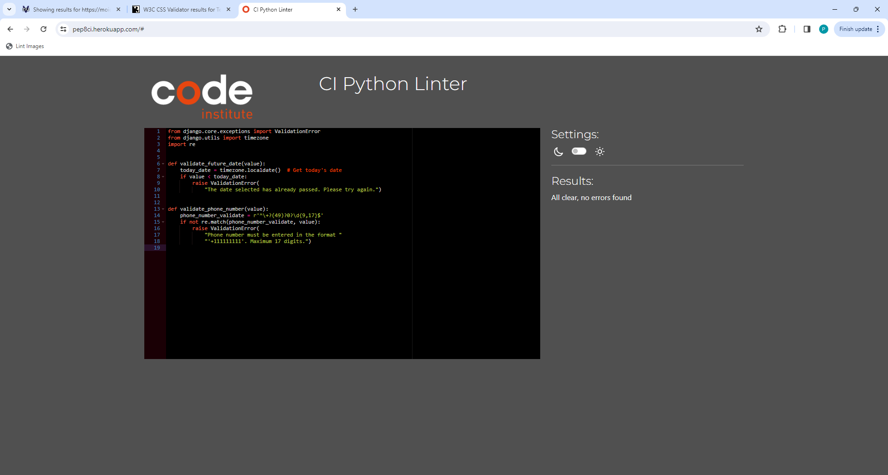
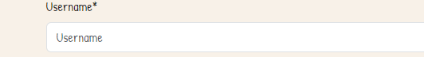
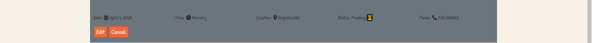
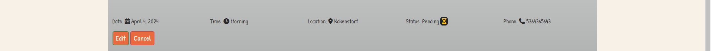

# Testing

> [!NOTE]  
> Return back to the [README.md](README.md) file.

## Code Validation

### HTML

I have used the recommended [HTML W3C Validator](https://validator.w3.org) to validate all of my HTML files.

| Directory | File | Screenshot | Notes |
| --- | --- | --- | --- |
| index | index.html |  | |
| reservation | cancel_reservation_confirm.html |  | |
| reservation | delete_reservation_confirm.html |  | |
| reservation | edit_reservation.html |  | |
| reservation | mo_calendar.html |  | |
| Reservation | profile.html |  | |
| accounts | login.html |  | |
| accounts | password_change.html |  | |
| accounts | password_reset_done.html |  | |
| accounts | password_reset_form_key_done.html |  | |
| accounts | password_reset_form_key.html |  | |
| accounts | logout.html |  | |
| accounts | signup.html |  | |

### CSS

I have used the recommended [CSS Jigsaw Validator](https://jigsaw.w3.org/css-validator) to validate all of my CSS files.

| Directory | File | Screenshot | Notes |
| --- | --- | --- | --- |
| static | ice.css |  | |

### Python

I have used the recommended [PEP8 CI Python Linter] ) to validate all of my Python files.

| Directory | File | CI URL | Screenshot | Notes |
| --- | --- | --- | --- | --- |
| ice_project | settings.py | [PEP8 CI](https://pep8ci.herokuapp.com/https://raw.githubusercontent.com/primarypigments/mo_ice_cream/main/ice_project/settings.py) |  | |
| ice_project | urls.py | [PEP8 CI](https://pep8ci.herokuapp.com/https://raw.githubusercontent.com/primarypigments/mo_ice_cream/main/ice_project/urls.py) |  | |
| index | admin.py | [PEP8 CI](https://pep8ci.herokuapp.com/https://raw.githubusercontent.com/primarypigments/mo_ice_cream/main/index/admin.py) |  | |
| index | urls.py | [PEP8 CI](https://pep8ci.herokuapp.com/https://raw.githubusercontent.com/primarypigments/mo_ice_cream/main/index/urls.py) |  | |
| index | views.py | [PEP8 CI](https://pep8ci.herokuapp.com/https://raw.githubusercontent.com/primarypigments/mo_ice_cream/main/index/views.py) |  | |
|  | manage.py | [PEP8 CI](https://pep8ci.herokuapp.com/https://raw.githubusercontent.com/primarypigments/mo_ice_cream/main/manage.py) |  | |
| reservation | admin.py | [PEP8 CI](https://pep8ci.herokuapp.com/https://raw.githubusercontent.com/primarypigments/mo_ice_cream/main/reservation/admin.py) |  | |
| reservation | forms.py | [PEP8 CI](https://pep8ci.herokuapp.com/https://raw.githubusercontent.com/primarypigments/mo_ice_cream/main/reservation/forms.py) |  | |
| reservation | models.py | [PEP8 CI](https://pep8ci.herokuapp.com/https://raw.githubusercontent.com/primarypigments/mo_ice_cream/main/reservation/models.py) |  | |
| reservation | urls.py | [PEP8 CI](https://pep8ci.herokuapp.com/https://raw.githubusercontent.com/primarypigments/mo_ice_cream/main/reservation/urls.py) |  | |
| reservation | validators.py | [PEP8 CI](https://pep8ci.herokuapp.com/https://raw.githubusercontent.com/primarypigments/mo_ice_cream/main/reservation/validators.py) |  | |
| reservation | views.py | [PEP8 CI](https://pep8ci.herokuapp.com/https://raw.githubusercontent.com/primarypigments/mo_ice_cream/main/reservation/views.py) |  | |

## Browser Compatibility

I've tested my deployed project on multiple browsers to check for compatibility issues.

| Browser | Home | Contact | Register | Sign In | Make Res | Profile | Edit Res | Cancel Res | Delete Res | PW Reset | PW Reset Done | Set PW | PW Reset Key | Sign Out |
| --- | --- | --- | --- | --- | --- | --- | --- | --- | --- | --- | --- | --- | --- | --- |  
| Chrome |  |  |  |  |  |  |  |  |  |  |  |  |  |  | Works as expected |

| Brave |  |  |  |  |  |  |  | | |  |  | | |  |Works as expected |
| Opera |  |  |  |  | Minor differences |

## Responsiveness

🛑🛑🛑🛑🛑🛑🛑🛑🛑🛑-START OF NOTES (to be deleted)

Use this space to discuss testing the live/deployed site on various device sizes.

The minimum requirement is for the following 3 tests:
- Mobile
- Tablet
- Desktop

**IMPORTANT**: You must provide screenshots of the tested responsiveness, to "prove" that you've actually tested them.

Using the "amiresponsive" mockup image (or similar) does not suffice the requirements.
Consider using some of the built-in device sizes in the Developer Tools.

If you have tested the project on your actual mobile phone or tablet, consider also including screenshots of these as well.
It showcases a higher level of manual tests, and can be seen as a positive inclusion!

Sample responsiveness testing documentation:

🛑🛑🛑🛑🛑🛑🛑🛑🛑🛑-END OF NOTES (to be deleted)

I've tested my deployed project on multiple devices to check for responsiveness issues.

| Device | Home | Contact | Register | Sign In | Make Res | Profile | Edit Res | Cancel Res | Delete Res | PW Reset | PW Reset Done | Set PW | PW Rest Key | Log Out |
| --- | --- | --- | --- | --- | --- |
| Mobile (DevTools) |  |  |  |  | Works as expected |
| Tablet (DevTools) |  |  |  |  | Works as expected |
| Desktop |  |  |  |  | Works as expected |
| XL Monitor |  |  |  |  | Scaling starts to have minor issues |
| 4K Monitor |  |  |  |  | Noticeable scaling issues |
| Google Pixel 7 Pro |  |  |  |  | Works as expected |
| iPhone 14 |  |  |  |  | Works as expected |
| repeat for any other tested browsers | x | x | x | x | x |

## Lighthouse Audit

I've tested my deployed project using the Lighthouse Audit tool to check for any major issues.

| Page | Mobile | Desktop | Notes |
| --- | --- | --- | --- |
| Home |  |  | Some minor warnings |
| Contact |  | ![screenshot]documentation/validation/lighthouse_contact_desktop.png) | Some minor warnings |
| Register |  |  | Some minor warnings |
| Sign In |  |  | Some minor warnings |
| Make Reservation |  |  | Some minor warnings |
| Profile |  |  | Slow response time due to large images |
| Edit |  |  | Some minor warnings |
| Cancel |  |  | Some minor warnings |
| Delete |  |  | Some minor warnings |
| Forgot Password |  |  | Some minor warnings |
| Set PW |  |  | Some minor warnings |
| PW Reset Key |  |  | Some minor warnings |
| Sign Out |  |  | Some minor warnings |

## Defensive Programming

Defensive programming was manually tested with the below user acceptance testing:

| Page | Expectation | Test | Result | Fix | Screenshot |
| --- | --- | --- | --- | --- | --- |
| Home | | | | | |
| | Contact is expected to do go to contact page when the user clicks on link | Tested the feature by doing clicking on link | The feature behaved as expected, and it did go to contact page | Test concluded and passed | ![screenshot]|(documentation/features/contact.png) |
| | Register is expected to do go to register page when the user clicks on link | Tested the feature by doing clicking on link | The feature behaved as expected, and it did go to register page | Test concluded and passed | ![screenshot]|(documentation/features/register.png) |
| | Sign In is expected to do go to Sign In page when the user clicks on link | Tested the feature by doing clicking on link | The feature behaved as expected, and it did go to Sign In page | Test concluded and passed | ![screenshot]|(documentation/features/signin.png) |
| | Profile is expected to do go to profile page when the user clicks on link | Tested the feature by doing clicking on link | The feature behaved as expected, and it did go to profile page | Test concluded and passed | ![screenshot]|(documentation/features/feature01.png) |
| | Make Reservation is expected to do go to Make Reservation page when the user clicks on link | Tested the feature by doing clicking on link | The feature behaved as expected, and it did go to Make Reservation page | Test concluded          and passed |  |
| | Sign Out is expected to do go to Sign Out page when the user clicks on link | Tested the feature by doing clicking on link | The feature behaved as expected, and it did go to Log Out page | Test concluded and passed | ![screenshot]|(documentation/features/signout.png) |
| | About Us modal is expected to open 3 different modals when the user clicks on them | Tested the feature by doing clicking on the modal | The feature behaved as expected, and they did opened when clicked | Test concluded and passed |  |
|
| Contact | | | | | |
| | Name is expected to be required when the user does not not fill it out | Tested the feature by leaving it blank | The feature behaved as expected, and it give the user a message a the input is required | Test concluded and passed |  |
| | Email is expected to be required when the user does not not fill it out | Tested the feature by leaving it blank | The feature behaved as expected, and it give the user a message a the input is required | Test concluded and passed |  |
| |Message is expected to be required when the user does not not fill it out | Tested the feature by leaving it blank | The feature behaved as expected, and it give the user a message a the input is required | Test concluded and passed |  |
| |Send Message Button is expected to send message to sever so that the admin can reply | Tested the feature by clicking the button | The feature behaved as expected, and it give the user a message that message was sent | Test concluded and passed |  |
|
| Register | | | | | |
| | Username is expected to be required when the user does not not fill it out | Tested the feature by leaving it blank | The feature behaved as expected, and it give the user a message a the input is required | Test concluded and passed |  |
| | Email is expected to be required when the user does not not fill it out and will only accept email address format | Tested the feature by leaving it blank | The feature behaved as expected, and it give the user a message a the input is required or enter a valid email format message | Test concluded and passed |  |
| Password is expected to be required when the user does not not fill it out and will only accept password format | Tested the feature by leaving it blank and inouting a invalid passowrd format | The feature behaved as expected, and it give the user a message a the input is required or in enter valid format | Test concluded and passed |  |
| | Register Button is expected to post registration of user when user clicks on the button | Tested the feature by doing clicking on button | The feature behaved as expected, and it gave success message | Test concluded and passed |  |
|
| Sign In | | | | | |
| | Username is expected to be required when the user does not not fill it out | Tested the feature by leaving it blank | The feature behaved as expected, and it give the user a message a the input is required | Test concluded and passed |  |
| | Sign In Button is expected when successfull redirect to index page with a success message  | Tested the feature by filling out a valid username and password and clicking the sign in button | The feature behaved as expected, and it redirected to index page with success message. | Test concluded and passed |  |
| | Sign In Button is expected when invalid login the user is notified with a error message    | Tested the feature by filling out a invalid username and password and clicking the sign in button | The feature behaved as expected, and it redirected to index page with success message. | Test concluded and passed |  |
| | Forgot Passowrd Button expected to redirect to a forgot password page. | Tested the feature by clicking the button | The feature behaved as expected, and it redirected the user to the forgot passowrd page. | Test concluded and passed |  |

| MaKe Reservation | | | | | |
| | Phone Number is expected to be required when the user does not not fill it out | Tested the feature by leaving it blank | The feature behaved as expected, and it give the user a message a the input is required | Test concluded and passed |  |
| | Date Calendar is expected to display a calendar for the user to pick a date | Tested the feature by doing the calendar icon | The feature behaved as expected, and it displayed a calaendar | Test concluded and passed |  |
| | Time Slot is expected to display a list when the user click on the input field | Tested the feature by doing clicking input field | The feature behaved as expected, and it displayed a list | Test concluded and passed |  |
| | Location is expected to display a list when the user click on the input field | Tested the feature by doing clicking input field | The feature behaved as expected, and it displayed a list | Test concluded and passed |  |
| | Submit Reservation Button expected to redirect to a profile page with a success message. | Tested the feature by clicking the button | The feature behaved as expected, and it redirected the user to the profile page with a success message. | Test concluded and passed |  |

| Profile | | | | | |
| | Reservation list is expected to display users reservations when a user makes a reservation | Tested the feature by doing making a reservation | The feature behaved as expected, and it displays reservations | Test concluded and passed |  |
| | Edit Reservation Button expected to redirect to a Edit Reservation page. | Tested the feature by clicking the button | The feature behaved as expected, and it redirected the user to the Edit Reservation. | Test concluded and passed |  |
| | Cancel Reservation Button expected to redirect to a Cancel Reservation with. | Tested the feature by clicking the button | The feature behaved as expected, and it redirected the user to the Cancel Reservation Page. | Test concluded and passed |  |
Delete Reservation Button expected to redirect to a Cancel Reservation with. | Tested the feature by clicking the button | The feature behaved as expected, and it redirected the user to the Delete Reservation Page. | Test concluded and passed |  |

| Edit Reservtion | | | | | |
| | Phone Number is expected to be required when the user does not not fill it out | Tested the feature by leaving it blank | The feature behaved as expected, and it give the user a message a the input is required | Test concluded and passed |  |
| | Date Calendar is expected to display a calendar for the user to pick a date | Tested the feature by doing the calendar icon | The feature behaved as expected, and it displayed a calaendar | Test concluded and passed |  |
| | Time Slot is expected to display a list when the user click on the input field | Tested the feature by doing clicking input field | The feature behaved as expected, and it displayed a list | Test concluded and passed |  |
| | Location is expected to display a list when the user click on the input field | Tested the feature by doing clicking input field | The feature behaved as expected, and it displayed a list | Test concluded and passed |  |
| | Edit Reservation Button expected to redirect to a profile page with a success message. | Tested the feature by clicking the button | The feature behaved as expected, and it redirected the user to the profile page with a success message. | Test concluded and passed |  |
|
| Cancel Reservation | | | | | |
| | | Cancel Reservation Button expected to redirect to a profile page with a success message. | Tested the feature by clicking the button | The feature behaved as expected, and it redirected the user to the profile page with a success message. | Test concluded and passed |  |
| | | Cancel Button expected to redirect to a profile page. | Tested the feature by clicking the button | The feature behaved as expected, and it redirected the user to the profile page. | Test concluded and passed |  |
 |
| Delete Reservation | | | | | |
| | | Delete Reservation Button expected to redirect to a profile page with a success message. | Tested the feature by clicking the button | The feature behaved as expected, and it redirected the user to the profile page with a success message. | Test concluded and passed |  |
| | | Cancel Button expected to redirect to a profile page. | Tested the feature by clicking the button | The feature behaved as expected, and it redirected the user to the profile page. | Test concluded and passed |  | |
|
| Sign out | | | | | |
| | Sign Out Button is expected sign out user and redirect to index page with a success message  | Tested the feature by clicking the sign out button | The feature behaved as expected, and it redirected to index page with success message. | Test concluded and passed |  |
|
| Forgot Password | | | | | |
| | Email is expected to be required when the user does not not fill it out and will only accept email address format | Tested the feature by leaving it blank | The feature behaved as expected, and it give the user a message a the input is required or enter a valid email format message | Test concluded and passed |  |
| | Reset My Password Button is expected to send a email to user with reset password link and then redirect user to reset info page. | Tested the feature by doing filling out email inout and clicking Reset Password Button. | The feature behaved as expected, and it send a email and redirected to info page. | Test concluded and passed |  | |
|
| Change Password | | | | | |
| Password is expected to be required when the user does not not fill it out and will only accept password format | Tested the feature by leaving it blank and inouting a invalid passowrd format | The feature behaved as expected, and it give the user a message a the input is required or in enter valid format | Test concluded and passed |  |
| Reenter Password is expected to be required when the user does not not fill it out | Tested the feature by leaving it blank | The feature behaved as expected, and it give the user a message a the input is required | Test concluded and passed |  |
| | Change Password Button is expected to redirect user to password change confirmation page. | Tested the feature by doing filling out email inout and clicking Change Password Button. | The feature behaved as expected, and it  redirected to password change confirmation page. | Test concluded and passed |  | |
|
| Messages | | | | | |
| | Success Messages is expected when user successfully sign in, sign out, register, reservation, edit reservation, cancel reservation, delete reservation  user is shown a green success message  | Tested the feature by successfully sign in, sign out, register, reservation, edit reservation, cancel reservation, delete reservation | The feature behaved as expected, and they show user a green success message. | Test concluded and passed |  |

| repeat for all remaining pages | x | x | x | x | x |

🛑🛑🛑🛑🛑🛑🛑🛑🛑🛑-END OF NOTES (to be deleted)

## User Story Testing

🛑🛑🛑🛑🛑🛑🛑🛑🛑🛑-START OF NOTES (to be deleted)

Testing user stories is actually quite simple, once you've already got the stories defined on your README.

Most of your project's **features** should already align with the **user stories**,
so this should as simple as creating a table with the user story, matching with the re-used screenshot
from the respective feature.

🛑🛑🛑🛑🛑🛑🛑🛑🛑🛑-END OF NOTES (to be deleted)

| User Story | Screenshot |
| --- | --- |
| As a new site user, I would like to easily navigate the menu of ice cream flavors, so that I can quickly find that appeal to me and my family. |  |
| As a new site user, I would like to view images and descriptions of the ice cream flavors, so that I can make an informed decision about what to order based on taste preferences. |  |
| As a new site user, I would like to create an account to save my reservation, so that I can quickly keep track of my schedual. |  |
| As a returning site user, I would like to cancel an existing reservation, so that I can adjust my plans based on unforeseen schedule changes. |  |
| As a returning site user, I would like to delete a past reservation from my history, so that I can keep my account organized and focused on upcoming plans. |  |
| As a returning site user, I would like to edit the details of an existing reservation, so that I can adjust the time, date, or location according to my current needs. |  |
| As a site administrator, I should be able to view, edit, and delete any reservations, so that I can assist users with their booking needs and resolve any conflicts. |  |
| As a site administrator, I should be able to add, update, or remove ice cream flavors and descriptions, so that I can keep the menu current with available offerings. |  |
| As a site administrator, I should be able to manage the locations of the pop-up service, so that I can ensure accurate and up-to-date information is available for users. |  |

## Automated Testing

I have conducted a series of automated tests on my application.

I fully acknowledge and understand that, in a real-world scenario, an extensive set of additional tests would be more comprehensive.

### Python (Unit Testing)

🛑🛑🛑🛑🛑🛑🛑🛑🛑🛑-START OF NOTES (to be deleted)

Adjust the code below (file names, etc.) to match your own project files/folders.

🛑🛑🛑🛑🛑🛑🛑🛑🛑🛑-END OF NOTES (to be deleted)

I have used Django's built-in unit testing framework to test the application functionality.

In order to run the tests, I ran the following command in the terminal each time:

`python3 manage.py test name-of-app `

To create the coverage report, I would then run the following commands:

`coverage run --source=name-of-app manage.py test`

`coverage report`

To see the HTML version of the reports, and find out whether some pieces of code were missing, I ran the following commands:

`coverage html`

`python3 -m http.server`

Below are the results from the various apps on my application that I've tested:

| App | File | Coverage | Screenshot |
| --- | --- | --- | --- |
| Bag | test_forms.py | 99% |  |
| Bag | test_models.py | 89% |  |
| Bag | test_urls.py | 100% |  |
| Bag | test_views.py | 71% |  |
| Checkout | test_forms.py | 99% |  |
| Checkout | test_models.py | 89% |  |
| Checkout | test_urls.py | 100% |  |
| Checkout | test_views.py | 71% |  |
| Home | test_forms.py | 99% |  |
| Home | test_models.py | 89% |  |
| Home | test_urls.py | 100% |  |
| Home | test_views.py | 71% |  |
| Products | test_forms.py | 99% |  |
| Products | test_models.py | 89% |  |
| Products | test_urls.py | 100% |  |
| Products | test_views.py | 71% |  |
| Profiles | test_forms.py | 99% |  |
| Profiles | test_models.py | 89% |  |
| Profiles | test_urls.py | 100% |  |
| Profiles | test_views.py | 71% |  |
| x | x | x | repeat for all remaining tested apps/files |

#### Unit Test Issues

🛑🛑🛑🛑🛑🛑🛑🛑🛑🛑-START OF NOTES (to be deleted)

Use this section to list any known issues you ran into while writing your unit tests.
Remember to include screenshots (where possible), and a solution to the issue (if known).

This can be used for both "fixed" and "unresolved" issues.

🛑🛑🛑🛑🛑🛑🛑🛑🛑🛑-END OF NOTES (to be deleted)

## Bugs

🛑🛑🛑🛑🛑🛑🛑🛑🛑🛑-START OF NOTES (to be deleted)

This section is primarily used for JavaScript and Python applications,
but feel free to use this section to document any HTML/CSS bugs you might run into.

It's very important to document any bugs you've discovered while developing the project.
Make sure to include any necessary steps you've implemented to fix the bug(s) as well.

**PRO TIP**: screenshots of bugs are extremely helpful, and go a long way!

🛑🛑🛑🛑🛑🛑🛑🛑🛑🛑-END OF NOTES (to be deleted)

- JS Uncaught ReferenceError: `foobar` is undefined/not defined

    

    - To fix this, I _____________________.

- JS `'let'` or `'const'` or `'template literal syntax'` or `'arrow function syntax (=>)'` is available in ES6 (use `'esversion: 11'`) or Mozilla JS extensions (use moz).

    

    - To fix this, I _____________________.

- Python `'ModuleNotFoundError'` when trying to import module from imported package

    

    - To fix this, I _____________________.

- Django `TemplateDoesNotExist` at /appname/path appname/template_name.html

    

    - To fix this, I _____________________.

- Python `E501 line too long` (93 > 79 characters)

    

    - To fix this, I _____________________.

### GitHub **Issues**

🛑🛑🛑🛑🛑🛑🛑🛑🛑🛑-START OF NOTES (to be deleted)

An improved way to manage bugs is to use the built-in **Issues** tracker on your GitHub repository.
To access your Issues, click on the "Issues" tab at the top of your repository.
Alternatively, use this link: https://github.com/primarypigments/mo_ice_cream/issues

If using the Issues tracker for your bug management, you can simplify the documentation process.
Issues allow you to directly paste screenshots into the issue without having to first save the screenshot locally,
then uploading into your project.

You can add labels to your issues (`bug`), assign yourself as the owner, and add comments/updates as you progress with fixing the issue(s).

Once you've sorted the issue, you should then "Close" it.

When showcasing your bug tracking for assessment, you can use the following format:

🛑🛑🛑🛑🛑🛑🛑🛑🛑🛑-END OF NOTES (to be deleted)

**Fixed Bugs**

All previously closed/fixed bugs can be tracked [here](https://github.com/primarypigments/mo_ice_cream/issues?q=is%3Aissue+is%3Aclosed).

| Bug | Status |
| --- | --- |
| [JS Uncaught ReferenceError: `foobar` is undefined/not defined](https://github.com/primarypigments/mo_ice_cream/issues/1) | Closed |
| [Python `'ModuleNotFoundError'` when trying to import module from imported package](https://github.com/primarypigments/mo_ice_cream/issues/2) | Closed |
| [Django `TemplateDoesNotExist` at /appname/path appname/template_name.html](https://github.com/primarypigments/mo_ice_cream/issues/3) | Closed |

**Open Issues**

Any remaining open issues can be tracked [here](https://github.com/primarypigments/mo_ice_cream/issues).

| Bug | Status |
| --- | --- |
| [JS `'let'` or `'const'` or `'template literal syntax'` or `'arrow function syntax (=>)'` is available in ES6 (use `'esversion: 11'`) or Mozilla JS extensions (use moz).](https://github.com/primarypigments/mo_ice_cream/issues/4) | Open |
| [Python `E501 line too long` (93 > 79 characters)](https://github.com/primarypigments/mo_ice_cream/issues/5) | Open |

## Unfixed Bugs

🛑🛑🛑🛑🛑🛑🛑🛑🛑🛑-START OF NOTES (to be deleted)

You will need to mention unfixed bugs and why they were not fixed.
This section should include shortcomings of the frameworks or technologies used.
Although time can be a big variable to consider, paucity of time and difficulty understanding
implementation is not a valid reason to leave bugs unfixed.

If you've identified any unfixed bugs, no matter how small, be sure to list them here.
It's better to be honest and list them, because if it's not documented and an assessor finds the issue,
they need to know whether or not you're aware of them as well, and why you've not corrected/fixed them.

Some examples:

🛑🛑🛑🛑🛑🛑🛑🛑🛑🛑-END OF NOTES (to be deleted)

- On devices smaller than 375px, the page starts to have `overflow-x` scrolling.

    

    - Attempted fix: I tried to add additional media queries to handle this, but things started becoming too small to read.

- For PP3, when using a helper `clear()` function, any text above the height of the terminal does not clear, and remains when you scroll up.

    

    - Attempted fix: I tried to adjust the terminal size, but it only resizes the actual terminal, not the allowable area for text.

- When validating HTML with a semantic `section` element, the validator warns about lacking a header `h2-h6`. This is acceptable.

    

    - Attempted fix: this is a known warning and acceptable, and my section doesn't require a header since it's dynamically added via JS.

🛑🛑🛑🛑🛑🛑🛑🛑🛑🛑-START OF NOTES (to be deleted)

If you legitimately cannot find any unfixed bugs or warnings, then use the following sentence:

🛑🛑🛑🛑🛑🛑🛑🛑🛑🛑-END OF NOTES (to be deleted)

> [!NOTE]  
> There are no remaining bugs that I am aware of.